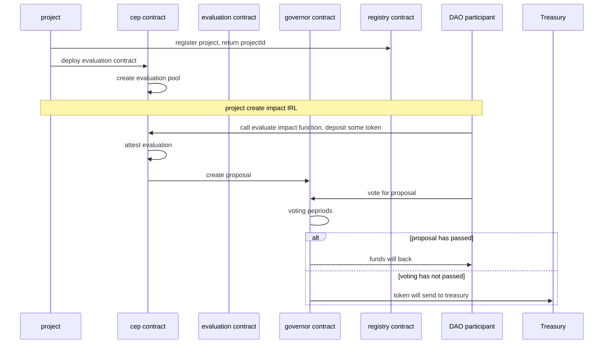

# Foundry Template [![Open in Gitpod][gitpod-badge]][gitpod] [![Github Actions][gha-badge]][gha] [![Foundry][foundry-badge]][foundry] [![License: MIT][license-badge]][license]

[gitpod]: https://gitpod.io/#https://github.com/tnkshuuhei/ie-dao
[gitpod-badge]: https://img.shields.io/badge/Gitpod-Open%20in%20Gitpod-FFB45B?logo=gitpod
[gha]: https://github.com/tnkshuuhei/ie-dao/actions
[gha-badge]: https://github.com/tnkshuuhei/ie-dao/actions/workflows/ci.yml/badge.svg
[foundry]: https://getfoundry.sh/
[foundry-badge]: https://img.shields.io/badge/Built%20with-Foundry-FFDB1C.svg
[license]: https://opensource.org/licenses/MIT
[license-badge]: https://img.shields.io/badge/License-MIT-blue.svg

