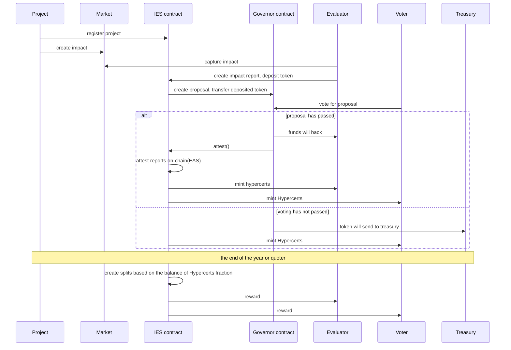
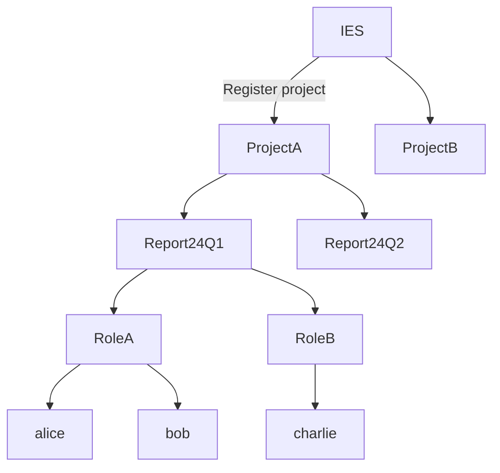

# [Impact Evaluation Service](https://hackmd.io/@shutanaka/ies) [![Open in Gitpod][gitpod-badge]][gitpod] [![Github Actions][gha-badge]][gha] [![Foundry][foundry-badge]][foundry] [![License: MIT][license-badge]][license]

[gitpod]: https://gitpod.io/#https://github.com/tnkshuuhei/ie-dao
[gitpod-badge]: https://img.shields.io/badge/Gitpod-Open%20in%20Gitpod-FFB45B?logo=gitpod
[gha]: https://github.com/tnkshuuhei/ie-dao/actions
[gha-badge]: https://github.com/tnkshuuhei/ie-dao/actions/workflows/ci.yml/badge.svg
[foundry]: https://getfoundry.sh/
[foundry-badge]: https://img.shields.io/badge/Built%20with-Foundry-FFDB1C.svg
[license]: https://opensource.org/licenses/MIT
[license-badge]: https://img.shields.io/badge/License-MIT-blue.svg

Market participants conduct impact evaluations on specific projects and create attestations on the blockchain. Grant operators such as Optimism and Gitcoin can permissionlessly reference the impact evaluations made on projects through IES via the blockchain.

## Problem we solve
Many ways to fund public goods and OSS have been invented in the last few years. Examples include [Quadratic Funding](https://www.wtfisqf.com/) and [Retroactive Public Goods Funding](https://medium.com/ethereum-optimism/retroactive-public-goods-funding-33c9b7d00f0c). These have been very successful and have brought great value to previously unfunded projects.
The problem, however, is that there is no outcome measurement or evaluation of what value the projects have subsequently brought to the world. In the case of retrospective funding, there are also cases where funding is provided without properly evaluating the results and impact of the project.
Outcome measurement is being done by [Open Source Observer](https://www.opensource.observer/) based on-chain and Github activity, and projects such as [Karma GAP](https://gap.karmahq.xyz/) are now able to observe project progress and outputs on a milestone basis.

Beyond that, there are still many issues to be addressed regarding evaluation.
Originally, project impact evaluations are very human resource and time consuming, and in the world, when involved in [Social Impact Bond(SIB)](https://en.wikipedia.org/wiki/Social_impact_bond), we sometimes outsource project impact evaluations to a group of experts, but these are contracts that exceed several million dollars. Contracts. If you are going to put this amount of money into an evaluation for funding a public good, you might as well put the money into funding it.
However, incentives for evaluators are essential, and IES exists to address this issue.

## Overview

## User Stories
### Impact Creators
#### Projects
- As impact evaluation is being introduced in grant programs like Gitcoin and Optimism, we want to conduct impact evaluations on our own products.
- We want to receive funding from more grants.

#### Grant Operators
- We want to conduct evaluations to improve the quality of grant programs.
- We want to attract more funding by evaluating grant programs.

### Evaluators
- We want opportunities to earn more funds.
- We want projects to receive funding based on appropriate evaluations.

### Voters
- We hope that by producing more appropriate reports, more OSS and public goods projects will receive funding.
- We want to earn funds by participating in governance.
- We want to make protocol decisions.

## Workflow
- Project owners register their project through the IES contract.
- Projects create impact in the market.
- Evaluators identify these facts from the market and evaluate the projects.
- Evaluators submit impact evaluation reports to the IES contract and deposit a certain amount of tokens.
- The IES contract creates a proposal through the Governor contract.
- Voters reference the report and vote through the Governor contract.
    - If passed:
        - The deposited tokens are returned.
        - The Governor contract creates an Attestation through the EAS contract.
        - The IES contract sends Hypercerts to the evaluator.
    - If rejected:
        - The deposited tokens are sent to the Treasury.
After a certain period:
- The owner of the IES contract creates a Split contract based on the Hypercerts Fraction through the IES contract and distributes the Treasury funds to the Hypercerts owners.

## Implementation
This product is built on top of the following stacks:
[Splits](https://splits.org) for funds distribution
[Ethereum Attestation Service](https://attest.org) for attestation
[Hats protocol](https://hatsprotocol.xyz) for on-chain role management
[Hypercerts](https://hypercerts.org) for impact certification

### Sequence Diagram

### Hats Tree

Projects register with IES

↓

Creation of impact reports

↓

Used in more applications, improving the grant experience

↓

Projects acquire more grants

↓

More projects register with IES

↓

Reports are created for more projects

As the grant experience improves, grant operators can be expected to provide funding to IES.
This serves as an incentive for evaluators, and more evaluators are expected to participate.
